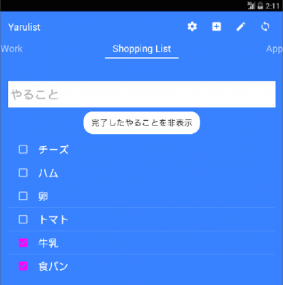

## Yarulist for Todoly

Yarulist for Todoly is a ToDo manager for [Todo.ly](https://todo.ly/).



## Used libraries

* OkHttp
* Retrofit
* RxJava
* ButterKnife
* Gson
* material-design-icons

## Building

Make an apk and install it to the connected device.

Enter the following command at the terminal:

```sh
$ ./gradlew installDebug
```

## License

Copyright (c) 2015 Jun Hiroe

* http://www.apache.org/licenses/LICENSE-2.0

